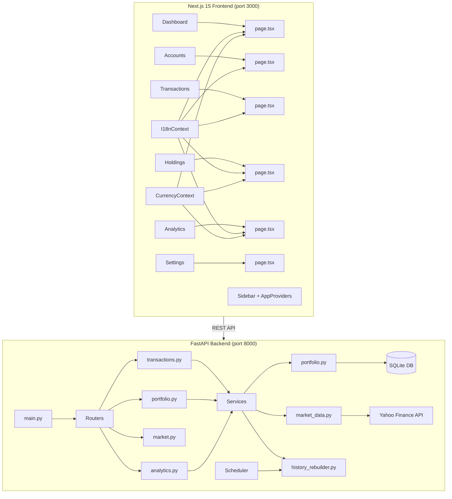
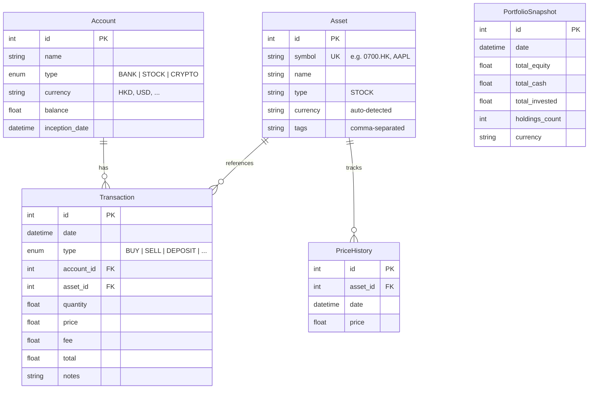

# Asset Manager 📈 | 個人資產管理系統

A full-stack portfolio tracking system for retail investors to manage multi-currency assets, track real-time market prices, and analyze historical portfolio performance.

全端個人資產管理系統，支援多幣種資產追蹤、即時行情、歷史績效分析。

---

## Features | 功能特色

### 💰 Account Management | 帳戶管理
- Create and manage multiple bank/brokerage accounts
- Support for multiple currencies (USD, HKD, MOP, CNY, TWD, JPY, EUR, GBP)
- Support for multiple currencies (USD, HKD, MOP, CNY, TWD, JPY, EUR, GBP)
- Auto-balance tracking — deposits, withdrawals, and fees update balances automatically
- **Account Inception Date** — Set initial date for accurate historical tracking
- **Delete Account** — Safely delete accounts and associated data via UI

### 📊 Transaction Engine | 交易引擎
- Full CRUD for transactions: Buy, Sell, Deposit, Withdraw, Interest, Dividend, Fee
- Edit and delete existing transactions with automatic balance recalculation
- **Smart currency detection** — auto-detects currency from stock symbol suffix (`.HK` → HKD, `.TW` → TWD)
- **Symbol validation** via Yahoo Finance before trade execution
- **Grouped & Collapsible View** — Recent transactions grouped by account for better organization
- **Asset Symbol Display** — View trading symbols directly in transaction lists
- Auto-creates assets on first buy, auto-deducts account balance

### 📈 Holdings & Portfolio | 持倉與投資組合
- Real-time market prices from Yahoo Finance
- **Multi-currency conversion** — HK stocks display in HK$, US stocks in $, totals unified to settlement currency
- Per-holding P/L and allocation percentage
- Portfolio summary: Total Invested, Total Market Value, Total Equity (investments + cash)

### 📉 Analytics & History | 分析與歷史
- **Historical portfolio rebuild** — reconstructs daily snapshots from transaction history (backfill from 2020)
- **Daily Price Backfill** — Fetches historical closing prices from Yahoo Finance for accurate asset valuation over time
- **Smart Caching** — Optimizes data fetching by checking local DB before querying external APIs
- **Automated Snapshots** — Background scheduler records daily portfolio value
- Total Asset Trend chart with interactive tooltips
- Asset allocation donut chart

### 🌐 i18n & Currency | 多語言與幣別
- Bilingual UI: English / 繁體中文
- Global settlement currency selector (USD, HKD, TWD, JPY, EUR, GBP, CNY, MOP)
- `formatNative()` for per-row native currency display, `format()` for unified totals

### ⚙️ Settings | 設定
- Rebuild portfolio history on demand
- Language and currency preferences

---

## Architecture | 系統架構



---

## Project Structure | 專案目錄結構

```
Assest/
├── README.md
├── asset-manager/                 # Next.js 15 Frontend
│   └── src/
│       ├── app/
│       │   ├── page.tsx           # Dashboard — Net Worth, Trend Chart, Allocation
│       │   ├── accounts/          # Account list & management
│       │   ├── transactions/      # Transaction CRUD with smart forms
│       │   ├── holdings/          # Live portfolio with native currency display
│       │   ├── analytics/         # Historical charts & metrics
│       │   └── settings/          # Rebuild history, language, currency
│       ├── components/
│       │   ├── Sidebar.tsx        # App navigation
│       │   ├── AppProviders.tsx   # Context wrapper
│       │   └── dashboard/
│       │       ├── AllocationChart.tsx
│       │       └── NetWorthChart.tsx
│       ├── context/
│       │   ├── I18nContext.tsx     # EN/ZH translations
│       │   └── CurrencyContext.tsx # Multi-currency conversion & formatting
│       └── lib/
│           ├── api.ts             # Axios instance (→ localhost:8000)
│           └── i18n.ts            # Translation strings
│
├── backend/                       # FastAPI + SQLModel Backend
│   ├── main.py                    # App entry, CORS, router registration
│   ├── database.py                # SQLite + SQLModel engine & session
│   ├── models.py                  # Account, Asset, Transaction, PriceHistory, PortfolioSnapshot
│   ├── routers/
│   │   ├── transactions.py        # CRUD, smart symbol detection, balance logic
│   │   ├── portfolio.py           # GET /portfolio/summary, /portfolio/history
│   │   ├── market.py              # GET /market/price/{symbol}, /market/validate/{symbol}
│   │   └── analytics.py           # POST /analytics/rebuild-history
│   ├── services/
│   │   ├── portfolio.py           # Holdings calc, multi-currency conversion to USD
│   │   ├── market_data.py         # Yahoo Finance price fetching + caching
│   │   └── history_rebuilder.py   # Daily snapshot reconstruction from 2020
│   ├── tests/                     # 9 test files (pytest)
│   │   ├── test_transactions.py
│   │   ├── test_transactions_edit.py
│   │   ├── test_portfolio.py
│   │   ├── test_analytics.py
│   │   ├── test_history_rebuild.py
│   │   ├── test_market_data.py
│   │   ├── test_tags.py
│   │   ├── test_validation.py
│   │   └── test_api.py
│   ├── alembic/                   # DB migrations
│   └── requirements.txt
```

---

## Tech Stack | 技術棧

| Layer | Technology | Purpose |
|---|---|---|
| **Frontend** | Next.js 15, React 19, TypeScript | SPA with App Router |
| **Styling** | Vanilla CSS + CSS Variables | Premium dark-sidebar glassmorphism UI |
| **Charts** | Recharts | Trend lines, allocation donuts |
| **Backend** | FastAPI, Python 3.11 | REST API with auto-docs |
| **ORM** | SQLModel (SQLAlchemy) | Type-safe models |
| **Database** | SQLite | Lightweight local storage |
| **Market Data** | yfinance | Real-time & historical prices |
| **Scheduling** | APScheduler | Daily background snapshot jobs |
| **Migrations** | Alembic | Schema evolution |
| **Testing** | Pytest | 9 test suites |

---

## Quick Start | 快速開始

### Prerequisites | 前置需求
- Python 3.11+ (recommend Conda)
- Node.js 18+
- npm or pnpm

### Backend Setup

```bash
# Create and activate environment
conda create -n asset_manager_env python=3.11 -y
conda activate asset_manager_env

# Install dependencies
cd backend
pip install -r requirements.txt

# Start server
uvicorn main:app --port 8000
```

### Frontend Setup

```bash
cd asset-manager
npm install
npm run dev
```

Open **http://localhost:3000** in your browser.

### Run Tests

```bash
cd backend
pytest tests/ -v
```

---

## API Endpoints | API 端點

| Method | Endpoint | Description |
|---|---|---|
| `GET` | `/accounts/` | List all accounts |
| `POST` | `/accounts/` | Create account |
| `PUT` | `/accounts/{id}` | Update account |
| `DELETE` | `/accounts/{id}` | Delete account |
| `GET` | `/transactions/` | List transactions (with filters) |
| `POST` | `/transactions/` | Create transaction |
| `PUT` | `/transactions/{id}` | Edit transaction |
| `DELETE` | `/transactions/{id}` | Delete transaction |
| `GET` | `/portfolio/summary` | Holdings + total equity |
| `GET` | `/portfolio/history` | Historical snapshots |
| `GET` | `/market/price/{symbol}` | Live price + currency |
| `GET` | `/market/validate/{symbol}` | Check symbol exists |
| `POST` | `/analytics/rebuild-history` | Rebuild snapshots from 2020 |

API docs available at **http://localhost:8000/docs** (Swagger UI).

---

## Data Models | 資料模型



---

## License

MIT
